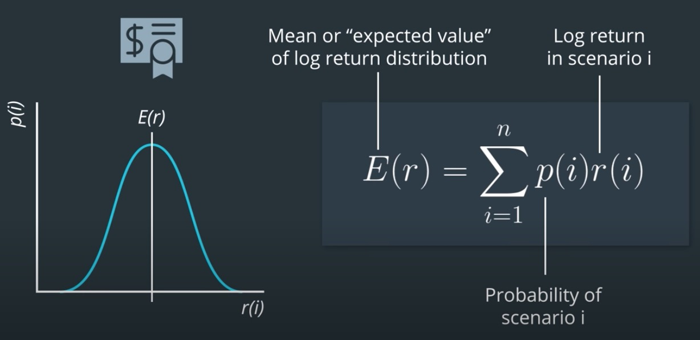
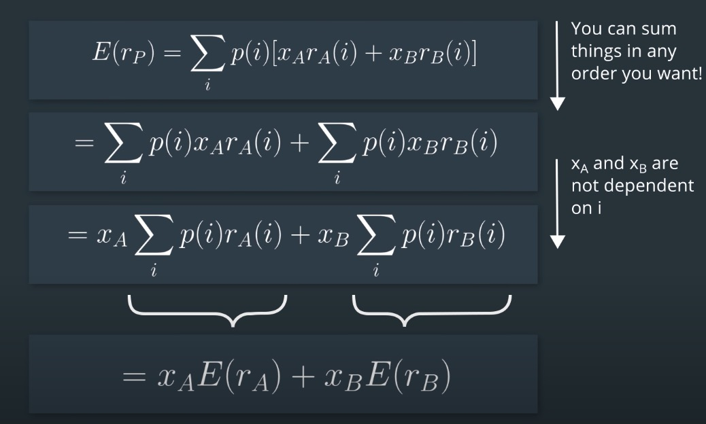
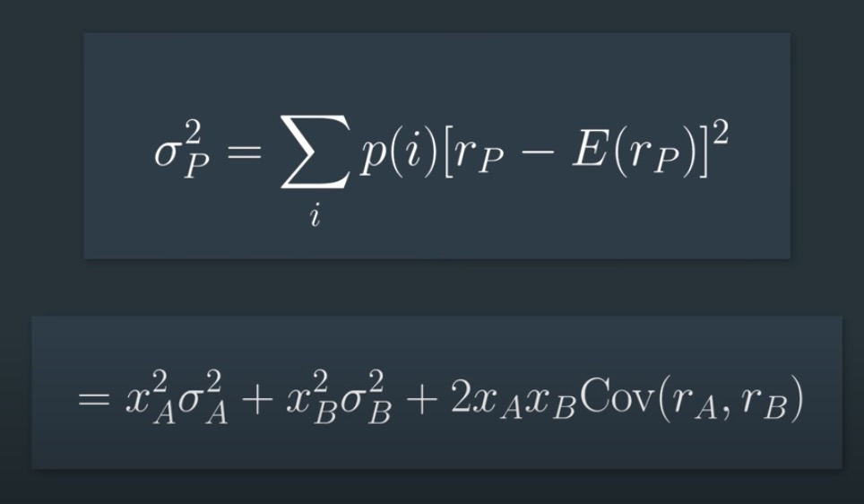
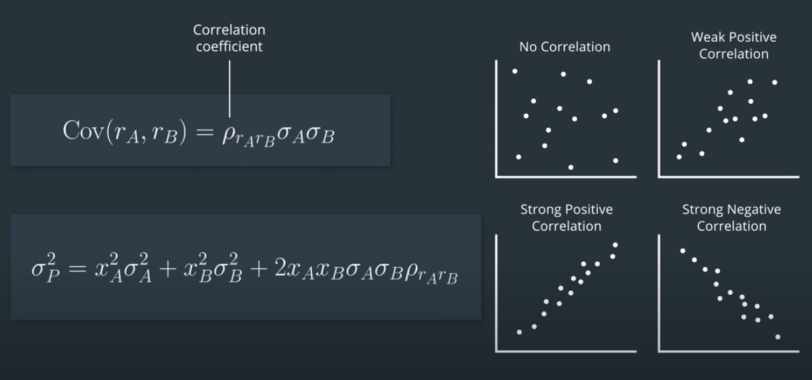
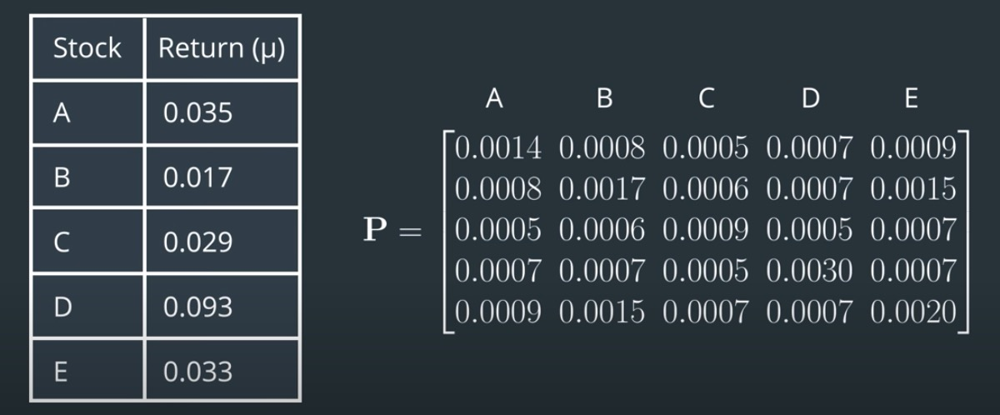
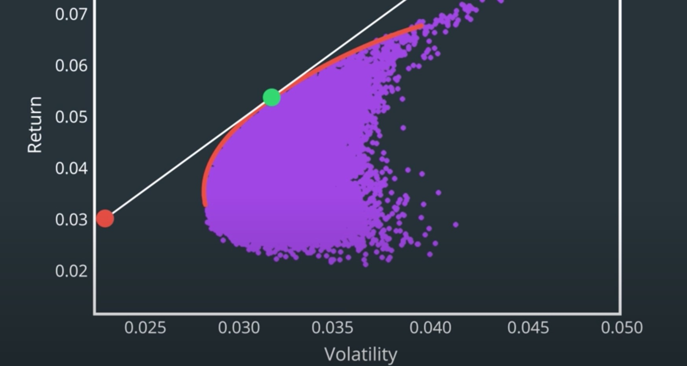

## review math concept

#### 1. portfolio expected log return:

#### 2. portfolio risk

#### 3. portfolio risk as matrix

$$Cov(rA,rB) = \frac{1}{1+n}\sum_{i=1}^{n}(rA_i-\bar{rA})(rB_i-\bar{rB})$$

suppose we have r1...rn and average of R = R-Rf, where Rf is asset expect return and Rf is a baseline of market return, so we have portfolio risk as below:

$$\sigma^2 = \begin{pmatrix}
  r_{1,1} & r_{1,2} & \cdots & r_{1,n} \\
  \vdots  & \vdots  & \ddots & \vdots  \\
  r_{m,1} & r_{m,2} & \cdots & r_{m,n} 
 \end{pmatrix} \odot
 \begin{pmatrix}
  r_{1,1} & \cdots & r_{m,1} \\
  r_{1,2} & \cdots & r_{m,2} \\
  \vdots  & \ddots & \vdots  \\
  r_{1,n} & \cdots & r_{m,n} 
 \end{pmatrix}$$ 

we can also denote $$P = \sigma^2 = R^TR$$

#### 4. portfolio Efficent Frontier

If we try all kind of portfolio combination, we got the a set of point can be calculated return and volatility then make a graph.

The curve line called Frontier can be look as a reasonable investment bettwen risk and return

The straight line called Captial Market Line which slope calculate as SharpRatio

#### 4.The Sharpe Ratio
The numerator of the Sharpe ratio is called the excess return, differential return as well as the risk premium. It’s called “excess return” because this is the return in excess of the risk-free rate. 

The risk premium denote with _D_ equals the portfolio return(R_p) minus risk free rate(R_f) over a period of time:

$$ D_t = R_p - R_f$$

$$ \bar{D} = \frac{1}{T}\sum_{t=1}^{n}D_t$$

$$ D_\sigma = \sqrt{\frac{\sum_{t}D_t-\bar{D}}{T-1}}$$

$$ SharpeRatio = \frac{\bar{D}}{D_\sigma} \approx \frac{R - R_m}{\sigma(R-R_m)} $$

where the R and R_m also can be portfolio expect return and market baseline as a free return.

#### 5. Simi-Deviation
Semi-deviation is calculated in a similar way as standard deviation, except it only includes observations that are less than the mean.

$$ \sigma = \frac{1}{T} \sum_{t=1}^{n}(\bar{R}-r_i)^2 \times I_ri$$

I_ri = 0 where ri>R_average else I_ri = 1

#### 6. Value-at-Risk (VaR)
Here is just an example to describe where to use it. VaR is defined as the maximum dollar amount expected to be lost over a given time horizon at a predefined confidence level. For example, if the 95% one month VaR is $1 million, there is 95% confidence that the portfolio will not lose more than $1 million next month.

  
