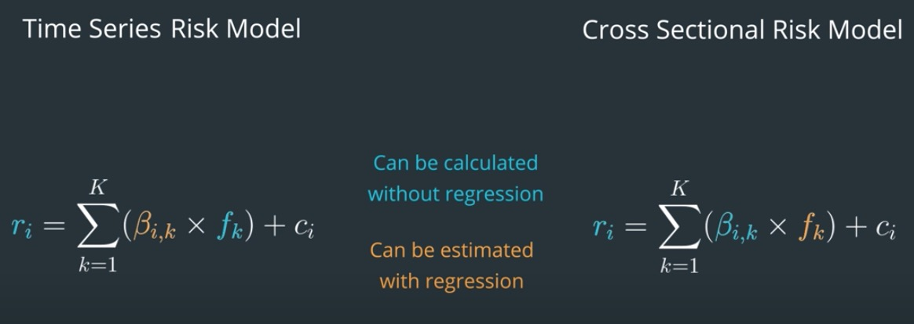

## Project Instruction
This project contains 5 seperate knowledge sections which involve the knowedge about this project need to be described in detial first: 
1. Doload stock data from Tushare and add some indicators.
2. Calculate two stocks portfolio variance as an example to familiar math concepts.
3. Estimate portfolio variance by PCA
4. Construct factor and estimate performance of factor by alphens package
5. Appendix some math concept about how to calculate portfolio variance

After master abvoe knowledge, we consturct some factors by academic paper(net address display below) and make up our portfolio. 
We will estimate this portfolio variace by PCA
We will estimate alpha factor return by alphalens and analysis the performance of these factors.
We can combine some factors and use convex optimization method to get portfolio weights.
So far, we don't eager to backtest this portfolio and got final return. 
After we learn more about ML method to combine factors we will involve to backtest.
The main code in `complete_knowedge_utilization.ipynb`

## Get Date
  We load data from [Tushare](https://tushare.pro/) platform, which is a quant trading data supplier and most of data can be use for free.
  We process data and add some indicators by `stockstats` python package.
  Here is an example of coding in `Tushare_Coding.ipynb` file you can get a view.

## Two Stocks Portfolio Variance Example
  Here is an example `portfolio_variance.ipynb` file to familiar how to code to calculte variance by Math Concept which display in the last institution.

## PCA as a risk model
  Sometimes, to calculate variance of portfolio easily traped into dimensional disaster. PCA is a way to solve this problem. It can estimate portfolio risk   by principle component variance of projection so that successed to got dimensionality reduction.
  `PCA_model.ipynb` file to familiar how to code to estimate variance of portfolio

## Factor Estimated Methods
There are many indicators can be calculated to estimate performance of the factors. The main indicators include
  1. Sharp Ratio: measure factors comprehensive performance(mean(factor_retrn)/std(factor_return))
  2. Accumulate Return: The facotor contribute to portfolio accumulate return (or factor accumulate return )
  3. IC value: measure the correlation bettwen return and factor (factors and returns alway expressed by nomal rank or zscore)
  4. Quantile: seperate factor value into some classes by each period and statistic each class mean return so that overview the monotonous and variance to express return.
  5. FRA(Factor Auto Correlation) or TurnOver：measure trade costs
  
  Here is an example `alphalens_coding.ipynb` file to show you how to use `alphalens` python package ti implement these method.
 
 ## Alpha Factors Implementation by Paper
 At last, we pick up four acdemic paper research on alpha factors to implement as this project final goal, The code file is `Alpha_on_Paper.ipynb`, Also there is another optional choice to view a custom factor created by mine. The performance you guess what?
 
 [Overnight Returns and Firm-Specific Investor Sentiment](https://papers.ssrn.com/sol3/papers.cfm?abstract_id=2554010)
 
 [The Formation Process of Winners and Losers in Momentum Investing](https://papers.ssrn.com/sol3/papers.cfm?abstract_id=2610571)
 
 [Expected Skewness and Momentum](https://papers.ssrn.com/sol3/papers.cfm?abstract_id=2600014)
 
 [Arbitrage Asymmetry and the Idiosyncratic Volatility Puzzle](https://papers.ssrn.com/sol3/papers.cfm?abstract_id=2155491)

## Review Math Concept
If we got some factors relate to our portfolio risk and return, we can bulid model to calculate that. If we found some strong relation bettwen facotrs and returns, these factor could be called alpha factors.

We can construct return model r = Bf + s which defined by CAPM(Captial Assets Pricing Model), each variance represent a matrix. r=Return, B=exposure of factor, s=can't explain variance. This model just explained as a liner model. 

Then, we calculate volatility of portfolio by facors denote E(rrT), Suppose the s contains independent facors to our factors thus cov(f,s)=0

Most of time, if we got our factors, we may seperate factor matrix as alpha matrix and risk matrix. Because we don't want to contraint our alpha facor in convex optimization process.

At last, as we use weight to calculate volatility of portfolio, the equation below. In order to calculate exposure B, we can use Fama French 3 Factor Model to regression the relationshap bettwen r(actual) and factors, then the r(estimate) = $\beta * f$. The spicific return S = r(actual) - r(estimate) 

There is another case, sometimes we may not dependent on Time Series Model, because we got each stock factor exposures at one time. 
For example, the book market ratio, net assets, industry etc. Something like not change for a long period time.
Thus, we need to regression factors at each time, it can be called Cross Sectional Model. After that, we can calculate portfolio variance.

