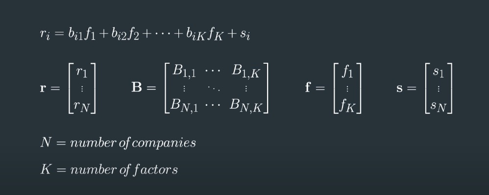
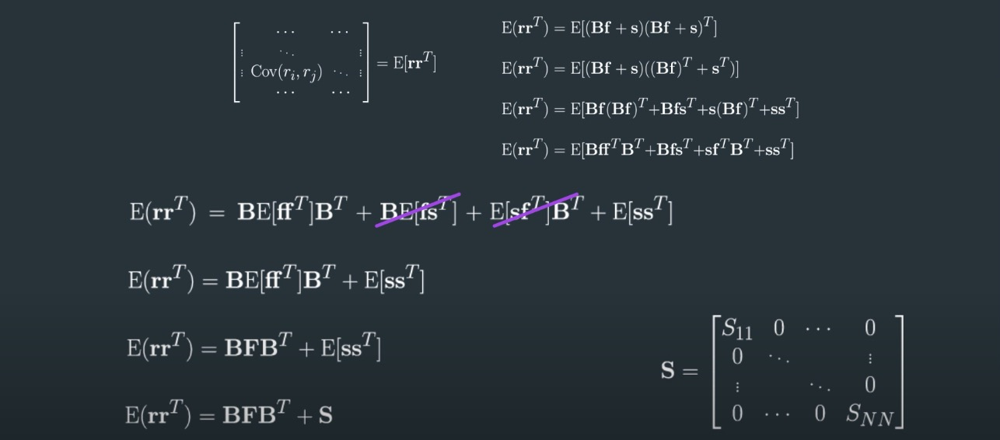
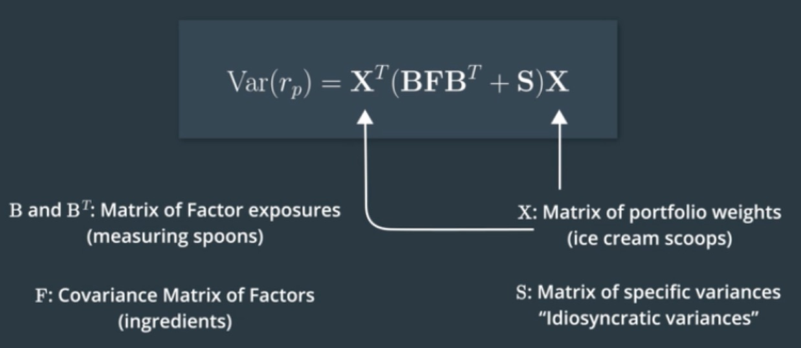
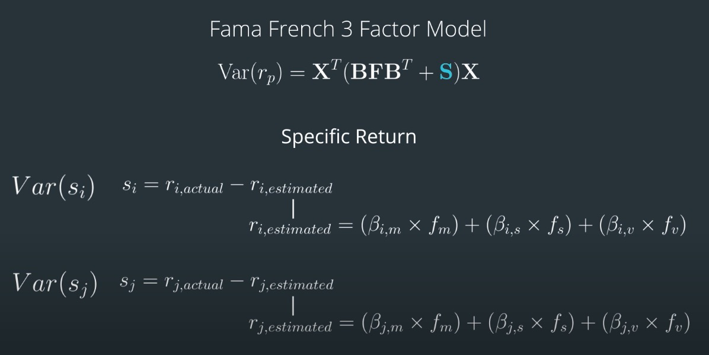

## Project Instruction

## Get Date
  We load data from [Tushare](https://tushare.pro/) platform, which is a quant trading data supplier and most of data can be use for free.
  We process data and add some indicators by `stockstats` python package.
  Here is an example of coding in `Tushare_Coding.ipynb` file you can get a view.

## Tow Stock Portfolio Variance Example
  Here is an example `portfolio_variance.ipynb` file to familiar how to code to calculte variance by math concept which display below.

## review math concept
If we got some factors relate to our portfolio risk and return, we can bulid model to calculate that. If we found some strong relation bettwen facotrs and returns, these factor could be called alpha factors.

We can construct return model r = Bf + s which defined by CAPM(Captial Assets Pricing Model), each variance represent a matrix. r=Return, B=exposure of factor, s=can't explain variance. This model just explained as a liner model. 

Then, we calculate volatility of portfolio by facors denote E(rrT), Suppose the s contains independent facors to our factors thus cov(f,s)=0

Most of time, if we got our factors, we may seperate factor matrix as alpha matrix and risk matrix. Because we don't want to contraint our alpha facor in convex optimization process.

At last, as we use weight to calculate volatility of portfolio, the equation below. In order to calculate exposure B, we can use Fama French 3 Factor Model to regression the relationshap bettwen r(actual) and factors, then the r(estimate) = $\beta * f$. The spicific return S = r(actual) - r(estimate) 

