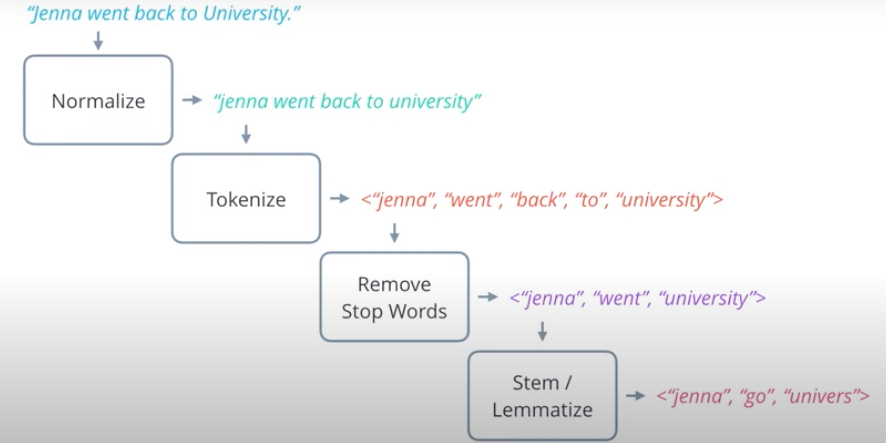
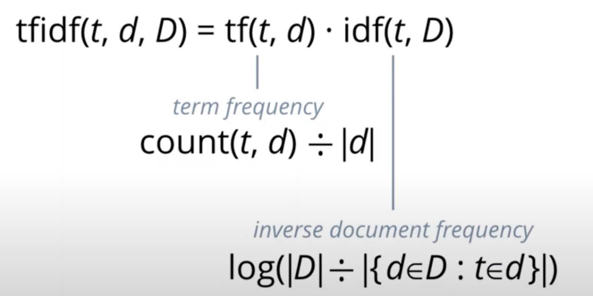
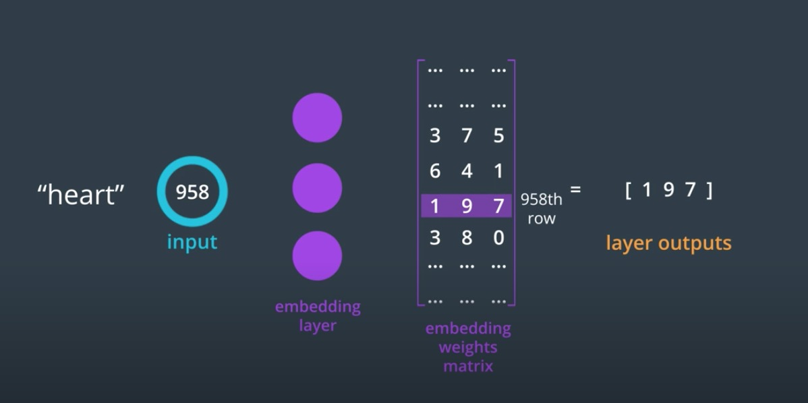
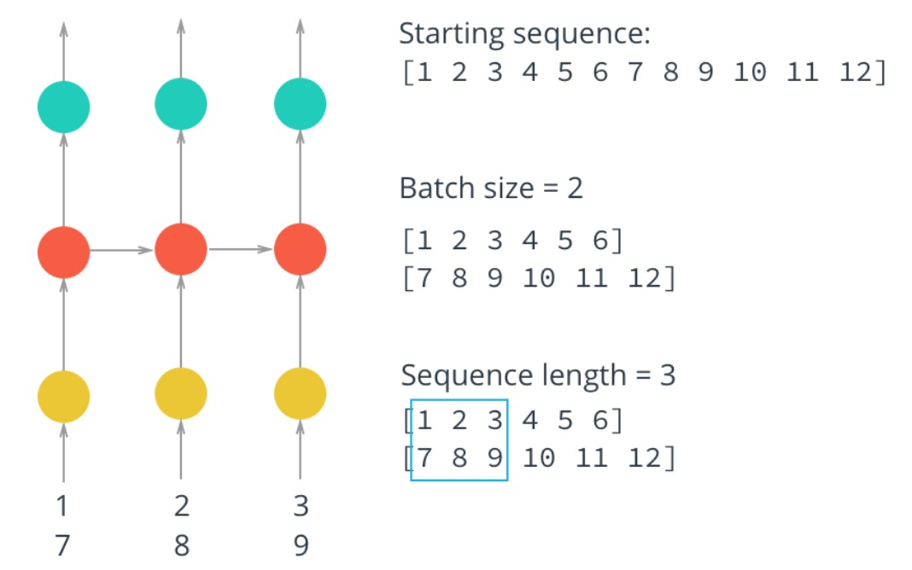

## Project Instruction
This project seperate three sections.
1. Familiar some tools of data clean and make up bag of words to predict sentiment of finacial satement by tf-idf and cosine_similarity methods.
2. How to contruct or use pretrained model of Embeding+LSTM to predict text sentiment
3. Familiar CNN model and transform learning.

## Financial Statement and Sentiment Analysis
In this section, I will construct a simple model to analysis the sentiment consistency based on company year and half year financial reports. `NLP_on_Finacial_Statement
.ipynb` is the source code, check it feel free.

  1. We download data by `requests`, and clean data by `re` and `BeautifulSoup4` 
  2. Then we can transform data to Bag of Words to calculate TF-IDF vectors. We use a sentiment word dict wchich is called Loughran McDonald Sentiment Word Lists(Chinese version). Youcan find in folder named "dict". 
  3. We use each vector of document bettwen time and neighbor to calcualte their similarity. We can choose `jaccard_score` or `cosine_similarity` method.
  4. As the conclusion, I found that the larger cosistency sentiment value, the higher the company's market cap.

## Sentiment Analysis Based on RNN
In this section, I wll introduce a NLP lib platform named `Paddlenlp`. Instead of implementing a Embding+LSTM model, I prefer record how to use some pretrained models in this platform and pretrained model like BERT、ERNIE、ALBERT、RoBERTa、XLNet etc. had exists as a industry baseline to use.

This section code is in `PaddleNLP.ipynb` file. Even if we can use these model got high accuracy results, there is another option to check is an introduction of how to makeup an Embeding+LSTM model in `rnn_sentiment.ipynb` file.

In addition, if you want to know some use of CNN and how to implement transform learning. You can check 'CNN_transform_leaning.ipynb' file. This file we download VGG16 as pretrained model and we replace last layer to a new fully connection layer to make up a complex classifier. Train model by transform leaning can get completed model very quickly.

## Concepts
NLP Data process step below: 

Note that, Chinese don't need to nomalized and Lemmatize. Chinese tokenize toolkit in python I apply is `pkuseg`, the stop words also apply `nltk`.

TF-IDF formula below:

The TF means a word frequency of one document. The IDF means is the word is nomal. TF-IDF express the word importance in all documents. We can look as a weight of key-word

As below is a serises model which contains Embeding layer(left) and LSTM or RNN(right) layer. 

The embeding layer is named word2vec, it can convert a word sequence number to vector expressed. Then, the vector input into the LSTM layers. This layer can auto cluste words by some expressed features bettwen context. One of the famous embeding layer as a pretrained baseline model named Bert.

The LSTM model as a sequence predict model can be trained by sequence vertors. This model will output result and hidden layer data at each step, the hidden layer as a long and short memory info input to the next epoch unit, and output data always processed by a fully connect layer and a sigmoid function.

